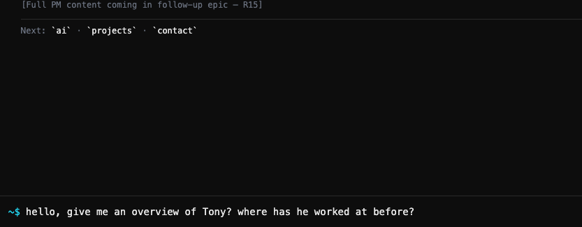
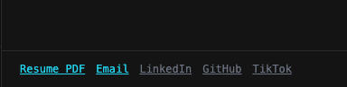
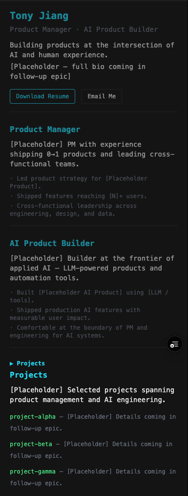
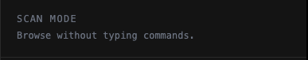
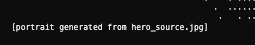

# Feedback batch — 2026-03-31 (Tony)

Source: Excel intake (converted by OpenClaw)
Priority: lower severity number = higher priority

## FB-001 — cli chat 
experience
- Severity: 2
- Area/page: main cli experience
- Expected: Chat Experience
- Actual: just CLI commands now

### Description
right now, the CLI is working like a normal CLI, which has the various commands and it's great, we want to keep these functionalities.
However, I want to make it more flexible, in that in addition to the CLI commands, i want to make the CLI a chat experience too. The 
chat experience would be powered by an LLM model that has context of myself, my experience, projects, etc, and would recommend 
commands for the visitor to learn about myself too. 

All the commands thawe have now should be / commands, and for the chat experience, the visior can just type and press enter to get 
response. it doesn't need a separate command to kick off that experience.

### Screenshot(s)
- 

## FB-002 — Consistent link colors
- Severity: 4
- Area/page: right hand overview panel
- Expected: same color
- Actual: not same color

### Description
Why are the link colors not consistent, they should be consistent for all the links here

### Screenshot(s)
- 

## FB-003 — persistent home/hero page
- Severity: 1
- Area/page: main cli
- Expected: persistent home ui
- Actual: it clears after user use the clear command

### Description
the home UI should be persistent even when the user clear the cli

## FB-004 — replace placeholder text
- Severity: 1
- Area/page: Hero, Product Manager page, AI Product builder page.
- Expected: more rich description according to my resume
- Actual: not placeholder text from original built.

### Description
update or replace text for the "product manager", "AI Product Builder" and "Hero" section based on information you can find in my resume.

Create a more appealing hero intro paragarph for the hero page. For "product manager" use my PM experience on the resume to fill in content. For "AI Product BUilder", maybe we should update this section's name actually. I want this section to cover my experiences as a AI researcher, data scientist (builder), and software engineer.  

leave projects blank for now.

### Screenshot(s)
- 

## FB-005 — remove unhelpful text
- Severity: 3
- Area/page: right hand panel, 

underneath my hero photo
- Expected: no text
- Actual: unhelpful text are shown

### Description
remove the following texts/sections in the screenshots

### Screenshot(s)
- 
- 

## FB-006 — slash commands
- Severity: 3
- Area/page: cli page
- Expected: slash command
- Actual: commands do not have slash in front.

### Description
this is related to the description for cli chat. I want all the commands to be slash commands, where user has to have "/" before it.
